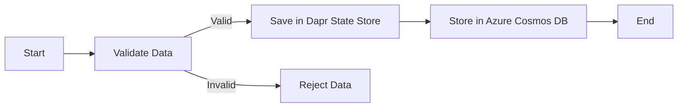

# Application for Data Validation and Storage

This Go application demonstrates data validation and storage using Dapr and Azure services. It validates data for individuals and organizations and stores it in both a Dapr state store and Azure Cosmos DB.

## Overview

The application defines two data structures: `Individual` and `Organization`. It performs validation based on predefined rules:
- For an `Individual`, the name must be present, and the personal number must be an 11-digit number.
- For an `Organization`, both the name and organization number must be present.

After validation, the data is stored in a Dapr state store and Azure Cosmos DB.

## Requirements

- Dapr CLI
- Go programming environment
- Azure account and Azure Key Vault setup
- Azure Cosmos DB account

## Application Structure

- `Individual` and `Organization` structs: Represent data structures for individuals and organizations.
- `IsValid` methods: Validate the data according to specified rules.
- `saveData` function: Handles the storage of validated data in the Dapr state store.
- `getKeyVaultToken` function: Retrieves secrets from Azure Key Vault.
- `getCosmosDBClient` and `storeDataInCosmosDB` functions: Handle connections and data storage in Azure Cosmos DB.

## Usage

To run this application:
1. Ensure Dapr is initialized and running.
2. Configure Azure Key Vault with necessary secrets for Cosmos DB.
3. Set appropriate environment variables for Azure authentication.
4. Execute the following command:

  ```shell
  dapr run --app-id myapp --dapr-http-port 3500 go run main.go
  ```

## Data Validation Logic

The validation logic within the `IsValid` methods of the `Individual` and `Organization` structs ensures adherence to the required format before storage.

## Application Workflow

The following flowchart describes the workflow of the application:



## Dapr State Management

Dapr is used for state management. The `saveData` function communicates with the Dapr sidecar to store data in the configured state store.

## Azure Integration

- **Azure Key Vault**: Used to securely store and access tokens and credentials.
- **Azure Cosmos DB**: Serves as the data storage solution, where validated data is stored.

## Future Enhancements

Future versions of this application may include:
- Enhanced validation rules.
- Integration with additional Dapr components and Azure services.
- Scalability and performance improvements.
